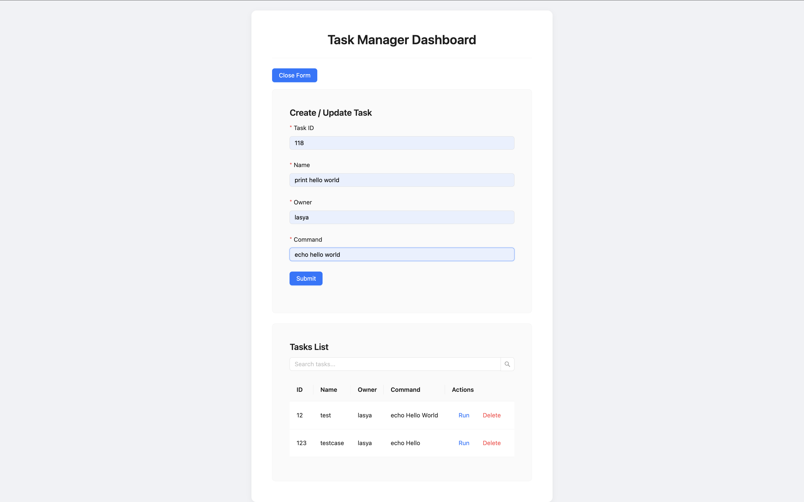
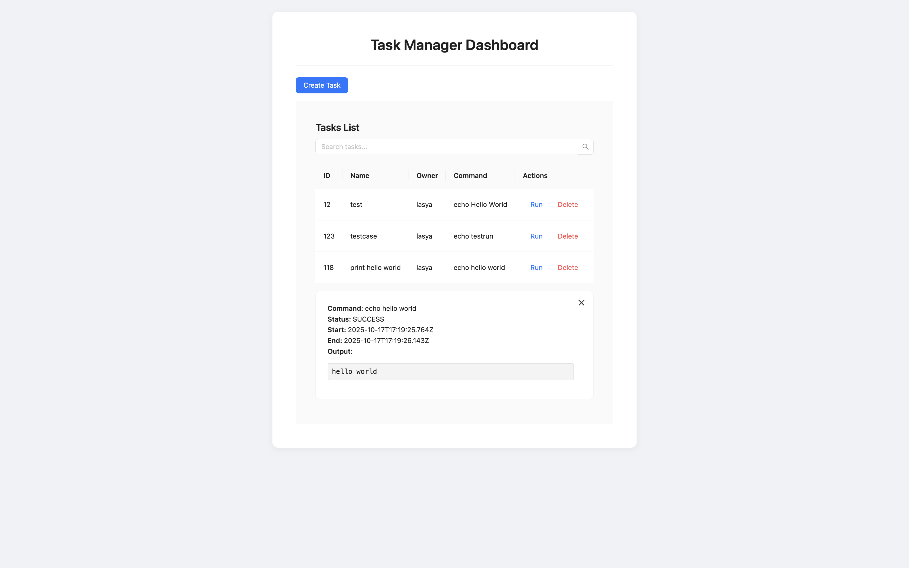
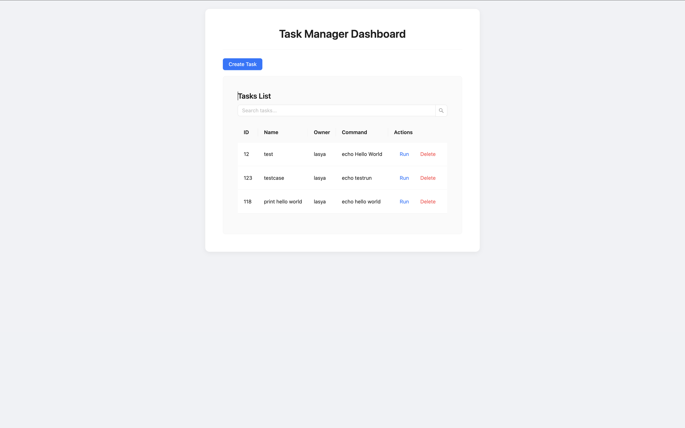
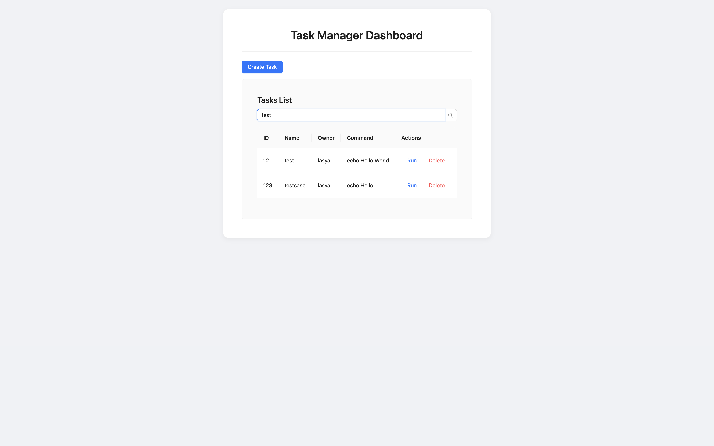
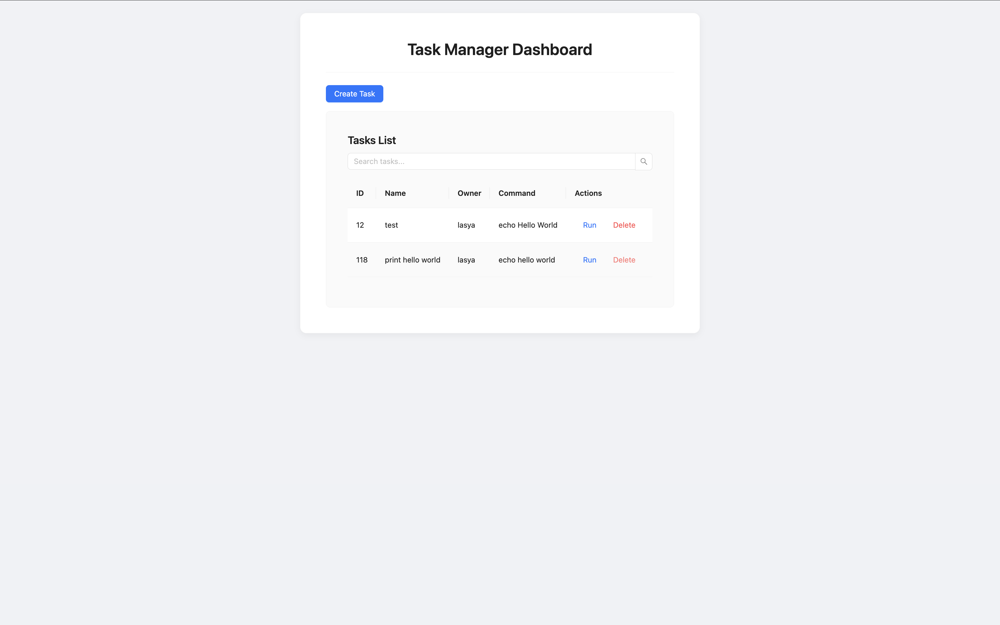

# Task-3

This is the **frontend** of the Task Manager application built using **React (TypeScript)** and **Ant Design**.  
It provides a clean dashboard to **create, view, run, search, and delete tasks**, and displays **real-time command execution results** fetched from the backend API.

---

## Project Overview

The Task Manager system allows users to:

- Create or update tasks with command details.
- Execute commands directly from the UI.
- View execution output, start time, end time, and status.
- Search and delete tasks easily.

---

## Features

- 🎯 Task creation, update, and deletion
- ⚙️ Command execution with live output
- 🔍 Search tasks by name
- 💾 Integration with backend REST API
- 🧑‍💻 Elegant and responsive Ant Design interface
- 🧭 Closeable execution results panel

---

## Tech Stack

| Category        | Technology                                                             |
| --------------- | ---------------------------------------------------------------------- |
| **Frontend**    | React 19, TypeScript                                                   |
| **UI Library**  | Ant Design                                                             |
| **HTTP Client** | Axios                                                                  |
| **Backend API** | Spring Boot (see [task-1 repo](https://github.com/Jlasi17/task-1.git)) |

---

## 🧰 Prerequisites

Ensure you have the following installed:

- Node.js (v18+)
- npm or yarn
- Backend server (`task-1`) running on **http://localhost:8080**

---

## ⚙️ Setup & Run

```bash
# Clone the repository
git clone https://github.com/Jlasi17/task-3.git
cd task-ui

# Install dependencies
npm install

# Start the development server
npm run dev
```

---

### Screenshots

#### 1️ Creating a Task


→ This screenshot shows the curl command used to create a new task in the Task API. The API successfully stores the task details (id, name, owner, and command) in MongoDB.

#### 2️ Running a Task


→ This displays the execution of the task via PUT /tasks/{id}/executions. The response includes the command, its output, status (SUCCESS), and timestamps.

#### 3 Get Tasks


→ Displays all stored tasks retrieved from the MongoDB-backed REST API.

#### 4 Search Task


→ Returns all tasks whose name contains the string Test.

#### 5 Delete Task


→ Demonstrates successful deletion of a specific task using its unique ID.

---
